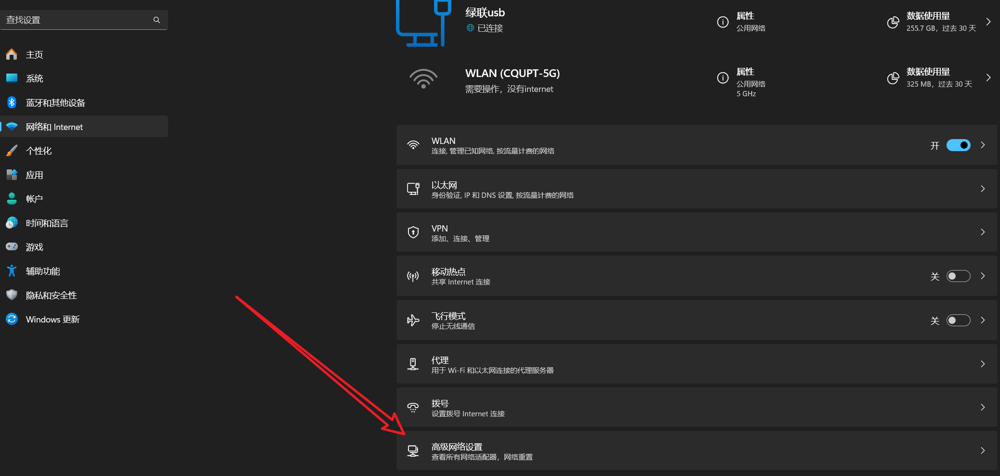
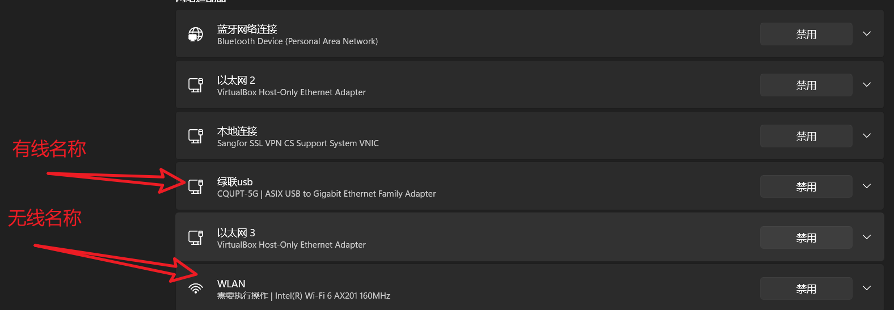
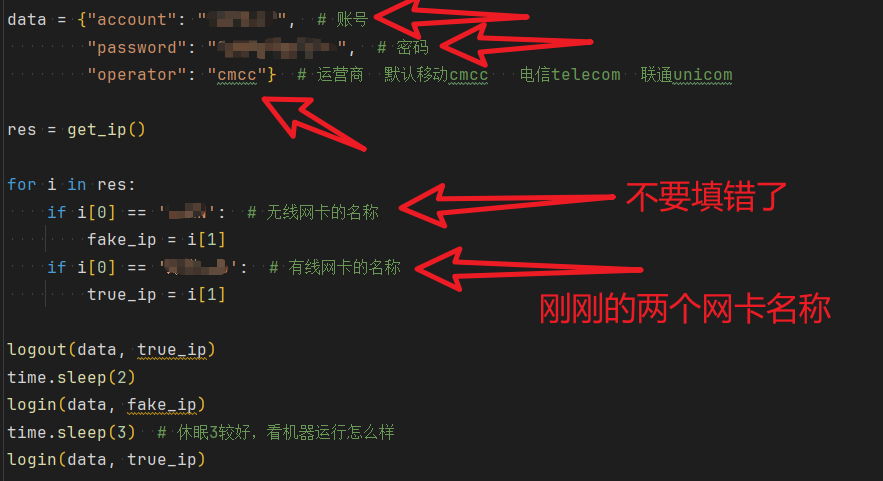
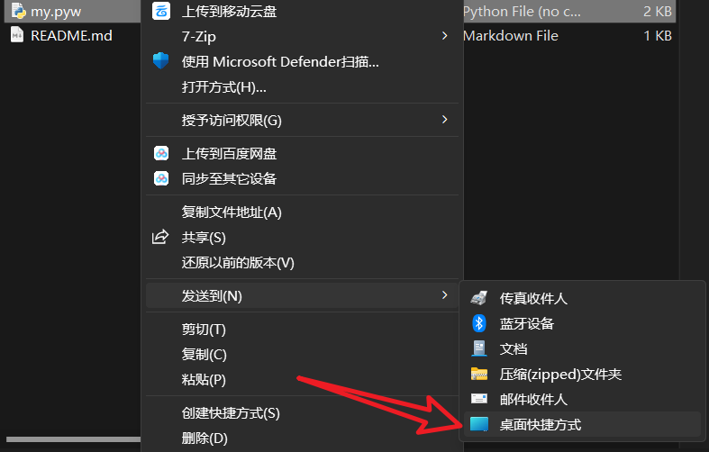

[点击下载(windows)](https://github.com/bangbang-0/CQUPT_login/releases/download/cqupt/cqupt.v1.0.release.exe)。

```shell
pip install -r requirements.txt
```

先安装依赖

有两个版本:

1. [attack](attack_version.py)是特别版只需要更改个人信息

2. [normal](normal_Version.py)版本需要连接wifi查看网关,然后更改个人信息和网关名称

解除限速(有线，无线可以自己改，wifi跑满也就40Mbps,有线可以跑满1000Mbps)

**1.attack版本使用方法**

填写资料


保存运行

**2.normal版本使用方法**
<big>**使用前确保电脑有线和无线都已经连接到校园网**</big>





使用方法


如果这样就成功了

可以尝试创建快捷方式,将后缀的py改为pyw(这样不会弹出窗口),然后发送快捷方式到桌面


测速网站 https://test.ustc.edu.cn/  

